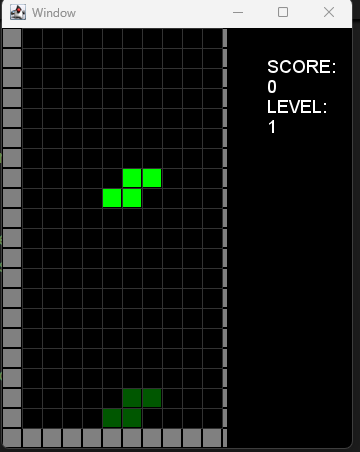
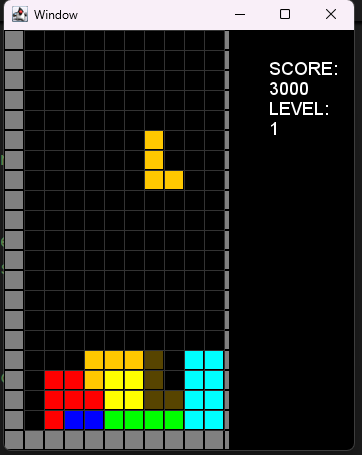
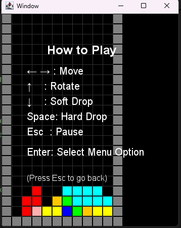
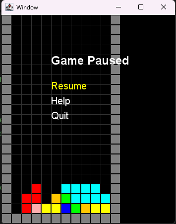

# 🎮 Tetris Game (Java OOP Edition)

Welcome to the Tetris Game project built using Java and object-oriented programming principles. This project demonstrates a modular design of a classic puzzle game using clean architecture, game loop logic, and custom rendering.

## 🗂️ Code Structure

| Class         | Description                                                                 |
|---------------|-----------------------------------------------------------------------------|
| `TetrisGame`  | Main controller class managing game state, input, rendering, and updates.   |
| `Board`       | Represents the Tetris grid. Handles collisions, placement, and row clearing.|
| `Piece`       | Represents and controls the falling Tetris block (Tetromino).               |
| `ScoreManager`| Manages player score and levels based on gameplay.                          |
| `GameState`   | Handles game status like pause, game over, and menu options.                |
| `InputHandler`| Deals with player inputs (keyboard events).                                 |
| `Renderer`    | Renders game objects using custom graphics engine.                          |

## 🖼️ Game Snapshots

Below are some gameplay screenshots showing different game states:

### ▶️ Game Start

### ▶️ Ghost Pieces

### 🧱 Help Screen

### 💥 Pause Menu

## 🧩 Class Diagram

*This UML diagram illustrates the main architecture of the Tetris game and how different components interact with each other.*

### 🧩 Class Diagram using Mermaid
[![](https://mermaid.ink/img/pako:eNqtVltPKzcQ_iurfVpEQBBCmu5DpXOAA6hQUIJ0zinhwayHjcXGXtlOKEX8947He_Fukj5UfUnW843n8o1n7I84UxziNM4KZsy5YLlmy7nkQkNmhZLRzXQu55LQ6AGsFuaSLSH6mMsoOnhWTPM0-ur-SJCttAZp7wVkkEb0R3KTKQ23TLIcdBrNghXBOZqcWWZxz2X9SYCQ5cpeMckLt-86WBGMvjhoB02rLxJbUcCZKpQ2aUT_j08kf2FF8SCWTp-r1XPhfRQqe92Q7i-ZkMkM85X541PEdG72SC6ksIn_1GAs09ZFXElMyd7kH_BGiVeyVckxm8Sbjrj1Uuc01Fogg-daldWyRO_2TC1LJZHOSvgK7_fo0wBPfof3izUiETTQFApg27AcLBUo2Qsq5aRnQbEc2JTLgWGNHNivmdNpauUUOoVz3ID9VvPtEvhszxFF4Y_Q_vfr84erNMJ0aXl1cX159dCucy04rR6ffBH3M0xTVwn5ipjvwi6E_KpWkpsEdQduA4b0rBQqy0rrLstWpUCCdmiUBcvAk1FreDXvdgHZ6xfJz5x7V5kCLPCpejNJSE1tuIkfWcIUkr0giYAJclc1U-m-fzRb_fpnb03HuZUxbNI1zBashA5LG5257xOj9e6zSknOHIB-CmFwACQ9lpZqDTfwYrfJpyJfbAXO1duGIWFusJOB9-Va-RO1tU0cnQtlsDWU5kKioulQ61V-JN0K_OyticSejDjcVaawwnW1CvYOmoC2HNX4u4E1FK11xjnpfVP6RkgIjmjbKm1-pNoLjgw2siCwpumqqPx0vlu7YRaQivJ7tsLh0JWahXq7gqLclJ5hL1mOVetCpTNyC3I1w2FD90NwPGvsrnQAjt56em5k2UbZL77xQ4WgSl5v8Qls2VABHXU_dJssWnYb0RTchMf4nMVCybzhn1IDTmZ9LjT_KJkO-eF1VPFfYGcgoz2eteuLTbFRL9bN_BINdxF3H6bBdUuxhe6SFvu3W-Y_3hjCzILQNhrUVfL8y6w31OsbuGIir-7yC5njmd_-Wij_r2fCjgt_v44paSMZeP8D73UQdYd3Y3ZQ29lrjhmNIfqt-9YZb1gIHkcHB79Vd1wa4VEzG6Af-zvAzrDZodP2_Q6FztncodNUrMbn0gcWxo9NgIhfbYnOnzva23HpVAN3NCZA43WFqo3fOhNfmcZZB6_j0MB4H6tp3Ib14tymEpJY4fEgdi-OOLV6BYMYny44JXAZ06Gex3YB2I1xip-c6dd5jMXHPSWTfyq1rLdptcoXcYrPTYMrT1H1tG5UKBCaRnE6mozJRpx-xH_F6cHoaHx4NDoenxz_Mjw5mQyHo0H87uTjk8OT4dHx6PhoPByfDkefg_hv8nt8eDo5PRoNx79OcMN4MhnEwIVV-rZ63bu_z38AhCAPJQ?type=png)](https://mermaid.live/edit#pako:eNqtVltPKzcQ_iurfVpEQBBCmu5DpXOAA6hQUIJ0zinhwayHjcXGXtlOKEX8947He_Fukj5UfUnW843n8o1n7I84UxziNM4KZsy5YLlmy7nkQkNmhZLRzXQu55LQ6AGsFuaSLSH6mMsoOnhWTPM0-ur-SJCttAZp7wVkkEb0R3KTKQ23TLIcdBrNghXBOZqcWWZxz2X9SYCQ5cpeMckLt-86WBGMvjhoB02rLxJbUcCZKpQ2aUT_j08kf2FF8SCWTp-r1XPhfRQqe92Q7i-ZkMkM85X541PEdG72SC6ksIn_1GAs09ZFXElMyd7kH_BGiVeyVckxm8Sbjrj1Uuc01Fogg-daldWyRO_2TC1LJZHOSvgK7_fo0wBPfof3izUiETTQFApg27AcLBUo2Qsq5aRnQbEc2JTLgWGNHNivmdNpauUUOoVz3ID9VvPtEvhszxFF4Y_Q_vfr84erNMJ0aXl1cX159dCucy04rR6ffBH3M0xTVwn5ipjvwi6E_KpWkpsEdQduA4b0rBQqy0rrLstWpUCCdmiUBcvAk1FreDXvdgHZ6xfJz5x7V5kCLPCpejNJSE1tuIkfWcIUkr0giYAJclc1U-m-fzRb_fpnb03HuZUxbNI1zBashA5LG5257xOj9e6zSknOHIB-CmFwACQ9lpZqDTfwYrfJpyJfbAXO1duGIWFusJOB9-Va-RO1tU0cnQtlsDWU5kKioulQ61V-JN0K_OyticSejDjcVaawwnW1CvYOmoC2HNX4u4E1FK11xjnpfVP6RkgIjmjbKm1-pNoLjgw2siCwpumqqPx0vlu7YRaQivJ7tsLh0JWahXq7gqLclJ5hL1mOVetCpTNyC3I1w2FD90NwPGvsrnQAjt56em5k2UbZL77xQ4WgSl5v8Qls2VABHXU_dJssWnYb0RTchMf4nMVCybzhn1IDTmZ9LjT_KJkO-eF1VPFfYGcgoz2eteuLTbFRL9bN_BINdxF3H6bBdUuxhe6SFvu3W-Y_3hjCzILQNhrUVfL8y6w31OsbuGIir-7yC5njmd_-Wij_r2fCjgt_v44paSMZeP8D73UQdYd3Y3ZQ29lrjhmNIfqt-9YZb1gIHkcHB79Vd1wa4VEzG6Af-zvAzrDZodP2_Q6FztncodNUrMbn0gcWxo9NgIhfbYnOnzva23HpVAN3NCZA43WFqo3fOhNfmcZZB6_j0MB4H6tp3Ib14tymEpJY4fEgdi-OOLV6BYMYny44JXAZ06Gex3YB2I1xip-c6dd5jMXHPSWTfyq1rLdptcoXcYrPTYMrT1H1tG5UKBCaRnE6mozJRpx-xH_F6cHoaHx4NDoenxz_Mjw5mQyHo0H87uTjk8OT4dHx6PhoPByfDkefg_hv8nt8eDo5PRoNx79OcMN4MhnEwIVV-rZ63bu_z38AhCAPJQ)
